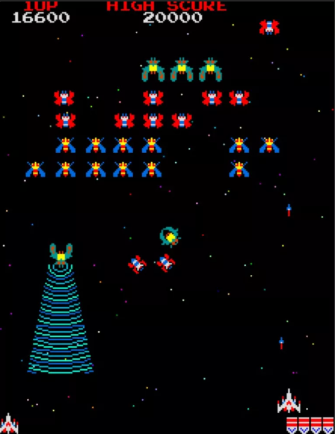

Galaga core for the MEGA65 R6
=============================

MEGA65 R6 port of Galaga arcade game, based on:

* MEGA65 R3 port https://github.com/sho3string/GalagaMEGA65.git done by sho3string
* MiSTer2MEGA65 https://github.com/sy2002/MiSTer2MEGA65.git done by sy2002
* Arcade-GnG_MiSTer https://github.com/sho3string/Arcade-Galaga_MiSTer.git done by sho3string

Bitstream can be generated using Vivado (eg. 2024.1), core file by coretool utility. 
For installation details (placing GnG roms on the SD card, etc) please refer to the R3 port repo.

In case of problems with display, try different resolutions and/or ports (HDMI/VGA).

Enjoy!
